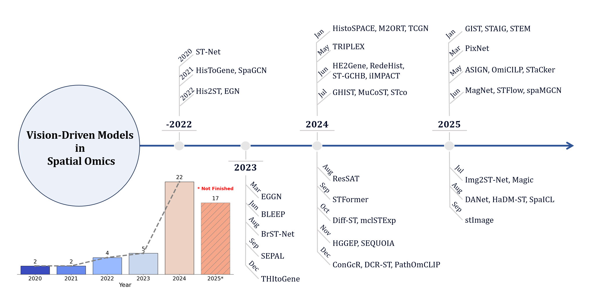
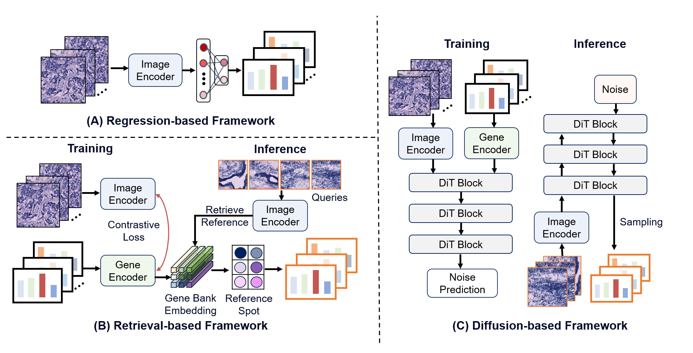

# 🧬Awesome Vision-driven Models for Spatial Omics

> A curated collection of papers, benchmarks, and resources on image-guided spatial transcriptomics and vision-based omics analysis.

  

Last updated: 10/05/2025

## 🎯About This Repository

This repo aims to record a comprehensive review of existing vision-driven spatial transcriptomics (ST) models,  covering methodological background, core architectures, and downstream applications,  highlighting the evolution of the field and the connections across different research directions.

We strongly encourage researchers who would like to promote their fantastic work to the vision-omics survey community  to make a pull request to update their paper’s information!

### Citation

Coming soon

## Overview

<figure style="text-align: center;">
  
  <figcaption>Overview of some well-known vision-driven models for spatial transcriptomics from 2020 to 2025 September.</em></figcaption>
</figure>

## 📖 Table of Contents

- [Overview](##Overview)
- [Vision-driven Models](##vision-driven-models)
  - [Clustering](###Clustering)
  - [Super-resolution](###super-resolution)
  - [Alignment/3D](###Alignment/3D-Modeling)
  - [Image-to-ST Translation](###image-to-st-translation)
    - [Regression-based](####regression-based)
    - [Retrieval-based](####Retrieval-based)
    - [Generation-based](####Generation-based)
- [Datasets & Benchmarks](#datasets--benchmarks)
- [Evaluation Metrics](#evaluation-metrics)

## Vision-driven Models

> 📘Summary of vision-driven models and their downstream tasks can be found in Table. 1 in our survey paper.

<figure style="text-align: center;">
  
  <figcaption>Representative downstream tasks enabled by histology and ST, including super-resolution, image-to-ST profile translation, clustering into spatial domains, and 3D alignment/reconstruction.</em></figcaption>
</figure>

------

### Clustering

**[Biorxiv 2020/Nature Communication 2023]** Robust mapping of spatiotemporal trajectories and cell–cell interactions in healthy and diseased tissues [[paper](https://www.nature.com/articles/s41467-023-43120-6)] [[code](https://github.com/BiomedicalMachineLearning/stLearn)]

**[Nature Method 2021]** SpaGCN: Integrating gene expression, spatial location and histology to identify spatial domains and spatially variable genes by graph convolutional network [[paper](https://www.nature.com/articles/s41592-021-01255-8)] [[code](https://github.com/jianhuupenn/SpaGCN)]

**[Biorxiv 2022]** conST: an interpretable multi-modal contrastive learning framework for spatial transcriptomics [[paper](https://www.biorxiv.org/content/10.1101/2022.01.14.476408v1#:~:text=Results%20We%20propose%20conST%2C%20a%20powerful%20and%20flexible,gene%20expression%2C%20spatial%20information%2C%20and%20morphology%20%28if%20applicable%29.)] [[code](https://github.com/ys-zong/conST)]

**[Briefings in Bioinformatics 2024]** Innovative super-resolution in spatial transcriptomics: a transformer model exploiting histology images and spatial gene expression [[paper](https://academic.oup.com/bib/article/25/2/bbae052/7618072)] [[code](https://github.com/Zhaocy-Research/TransformerST)]

**[Biorxiv 2024]** Spatial Transcriptomics Prediction from Histology Images at Single-cell Resolution using RedeHist [[paper](https://www.biorxiv.org/content/10.1101/2024.06.17.599464v1#:~:text=Here%20we%20introduce%20RedeHist%2C%20a%20novel%20deep%20learning,predict%20ST%20from%20histology%20images%20at%20single-cell%20resolution.)] [[code](https://github.com/Roshan1992/RedeHist/tree/main)]

**[Genome biology 2024]** iIMPACT: integrating image and molecular profiles for spatial transcriptomics analysis [[paper](https://genomebiology.biomedcentral.com/articles/10.1186/s13059-024-03289-5)] [[code](https://github.com/Xijiang1997/iIMPACT)]

**[Briefings in Bioinformatics 2024]** A multi-view graph contrastive learning framework for deciphering spatially resolved transcriptomics data [[paper](https://academic.oup.com/bib/article/25/4/bbae255/7683165)] [[code](https://github.com/tju-zl/MuCoST)]

**[Biorxiv 2024]** stFormer: a foundation model for spatial transcriptomics [[paper](https://www.biorxiv.org/content/biorxiv/early/2025/08/04/2024.09.27.615337.full.pdf)] [[code](https://github.com/csh3/stFormer)]

**[Computational and Structural Biotechnology Journal 2024]** Deep clustering representation of spatially resolved transcriptomics data using multi-view variational graph auto-encoders with consensus clustering [[paper](https://www.sciencedirect.com/science/article/pii/S2001037024004124)] [[code](https://github.com/wenwenmin/STMVGAE)]

**[Research 2025]** Deep Learning-Enabled Integration of Histology and Transcriptomics for Tissue Spatial Profile Analysis [[paper](https://spj.science.org/doi/10.34133/research.0568)] [[code](https://github.com/lengjk1214/GIST)]

**[Nature Communication 2025]** STAIG: Spatial transcriptomics analysis via image-aided graph contrastive learning for domain exploration and alignment-free integration [[paper](https://spj.science.org/doi/10.34133/research.0568)] [[code](https://github.com/lengjk1214/GIST)]

**[Nature Method 2025]** A visual-omics foundation model to bridge histopathology with spatial transcriptomics [[paper](https://www.nature.com/articles/s41592-025-02707-1)] [[code](https://github.com/GuangyuWangLab2021/Loki)]

**[Genome biology 2025]** spaMGCN: a graph convolutional network with autoencoder for spatial domain identification using multi-scale adaptation [[paper](https://genomebiology.biomedcentral.com/articles/10.1186/s13059-025-03637-z)] [[code](https://github.com/hongfeiZhang-source/spaMGCN)]

**[Briefings in Bioinformatics 2025]** SpaICL: image-guided curriculum strategy-based graph contrastive learning for spatial transcriptomics clustering [[paper](https://academic.oup.com/bib/article/26/4/bbaf433/8239088)] [[code](https://github.com/wenwenmin/SpaICL)]

**[Nature Method 2025]** Spatial gene expression at single-cell resolution from histology using deep learning with GHIST [[paper](https://www.nature.com/articles/s41592-025-02795-z)] [[code](https://github.com/SydneyBioX/GHIST/tree/main)]

------

### Super Resolution

**[Biorxiv 2021]** Leveraging information in spatial transcriptomics to predict super-resolution gene expression from histology images in tumors  [[paper](https://www.biorxiv.org/content/10.1101/2021.11.28.470212v1)] [[code](https://github.com/maxpmx/HisToGene)]

**[Scientific Reports 2022]** Efficient prediction of a spatial transcriptomics profile better characterizes breast cancer tissue sections without costly experimentation  [[paper](https://www.nature.com/articles/s41598-022-07685-4)] [[code](https://github.com/tmonjo/DeepSpaCE)]

**[Briefings in Bioinformatics 2024]** Innovative super-resolution in spatial transcriptomics: a transformer model exploiting histology images and spatial gene expression [[paper](https://academic.oup.com/bib/article/25/2/bbae052/7618072)] [[code](https://github.com/Zhaocy-Research/TransformerST)]

**[BIBM 2024]** High-Resolution Spatial Transcriptomics from Histology Images using HisToSGE [[paper](https://arxiv.org/pdf/2407.20518)] [[code](https://github.com/wenwenmin/HisToSGE)]

------

### Alignment/3D Modeling

**[Nature Communication 2025]** STAIG: Spatial transcriptomics analysis via image-aided graph contrastive learning for domain exploration and alignment-free integration [[paper](https://spj.science.org/doi/10.34133/research.0568)] [[code](https://github.com/lengjk1214/GIST)]

**[CVPR 2025]** ASIGN: Anatomy-aware Spatial Imputation Graphic Network for 3D Spatial Transcriptomics [[paper](https://openaccess.thecvf.com/content/CVPR2025/papers/Zhu_ASIGN_An_Anatomy-aware_Spatial_Imputation_Graphic_Network_for_3D_Spatial_CVPR_2025_paper.pdf)] [[code](https://github.com/hrlblab/ASIGN)]

**[Nature Method 2025]** A visual-omics foundation model to bridge histopathology with spatial transcriptomics [[paper](https://www.nature.com/articles/s41592-025-02707-1)] [[code](https://github.com/GuangyuWangLab2021/Loki)]

**[Scientific Reports 2025]** Image guided construction of a common coordinate framework for spatial transcriptome data

 [[paper](https://www.nature.com/articles/s41598-025-01862-x)] [[code](https://github.com/regeneron-mpds/stacker)]

**[Genome biology 2025]** spaMGCN: a graph convolutional network with autoencoder for spatial domain identification using multi-scale adaptation [[paper](https://genomebiology.biomedcentral.com/articles/10.1186/s13059-025-03637-z)] [[code](https://github.com/hongfeiZhang-source/spaMGCN)]

------

### Generative Spatial Omics

> Current learning paradigms mainly include three forms: (A) Regression-based prediction which directly maps histology tiles to gene expression profiles; (B) Retrieval-based searching that aligns image–gene representations and retrieves nearest reference spots to form predictions; (C) Diffusion-based generation which performs conditional noise prediction with a DiT and, at inference, denoises from noise to generate expression maps.

<figure style="text-align: center;">
  
  <figcaption>Learning paradigms for image-to-ST Translation Task</em></figcaption>
</figure>

------

#### Regression-based

**[Nature Biomedical Engineering 2020]** Integrating spatial gene expression and breast tumour morphology via deep learning  [[paper](https://www.nature.com/articles/s41551-020-0578-x)] [[code](https://github.com/bryanhe/ST-Net)]

**[Biorxiv 2021]** Leveraging information in spatial transcriptomics to predict super-resolution gene expression from histology images in tumors [[paper](https://www.biorxiv.org/content/10.1101/2021.11.28.470212v1)] [[code](https://github.com/maxpmx/HisToGene)]

**[Scientific Reports 2022]** Efficient prediction of a spatial transcriptomics profile better characterizes breast cancer tissue sections without costly experimentation [[paper](https://www.nature.com/articles/s41598-022-07685-4)] [[code](https://github.com/tmonjo/DeepSpaCE)]

**[Briefings in Bioinformatics 2022]** Spatial Transcriptomics Prediction from Histology jointly through Transformer and Graph Neural Networks [[paper](https://academic.oup.com/bib/article/23/5/bbac297/6645485)] [[code](https://github.com/biomed-AI/Hist2ST)]

**[WACV 2023]** Exemplar Guided Deep Neural Network for Spatial Transcriptomics Analysis of Gene Expression Prediction [[paper](https://openaccess.thecvf.com/content/WACV2023/papers/Yang_Exemplar_Guided_Deep_Neural_Network_for_Spatial_Transcriptomics_Analysis_of_WACV_2023_paper.pdf)] [[code](https://github.com/Yan98/EGN/tree/main)]

**[CVPR 2023]** SEPAL: Spatial Gene Expression Prediction from Local Graphs [[paper](https://arxiv.org/abs/2309.01036)] [[code](https://github.com/BCV-Uniandes/SEPAL)]

**[Scientific Reports 2023]** Breast cancer histopathology image-based gene expression prediction using spatial transcriptomics data and deep learning [[paper](https://www.nature.com/articles/s41598-023-40219-0)] [[code](https://github.com/Mamunur-20/BrSTNet)]

**[Pattern Recognition 2024]** Spatial Transcriptomics Analysis of Gene Expression Prediction using Exemplar Guided Graph Neural Network [[paper](https://www.sciencedirect.com/science/article/pii/S0031320323006647)] [[code](https://github.com/Yan98/EGN/tree/main)]

**[Briefings in Bioinformatics 2024]** THItoGene: a deep learning method for predicting spatial transcriptomics from histological images  [[paper](https://academic.oup.com/bib/article/25/1/bbad464/7494746)] [[code](https://github.com/yrjia1015/THItoGene)]

**[Methods 2024]** HistoSPACE: Histology-inspired spatial transcriptome prediction and characterization engine [[paper](https://www.sciencedirect.com/science/article/abs/pii/S1046202324002391)] [[code](https://github.com/samrat-lab/HistoSPACE)]

**[arXiv 2024]** M2ORT: many-to-one regression transformer for spatial transcriptomics prediction from histopathology images [[paper](https://arxiv.org/abs/2401.10608)] [[code](https://github.com/Dootmaan/M2ORT/)]

**[Medical Image Analysis 2024]** Transformer with Convolution and Graph-Node co-embedding: An accurate and interpretable vision backbone for predicting gene expressions from local histopathological image [[paper](https://www.sciencedirect.com/science/article/pii/S1361841523003006)] [[code](https://github.com/lugia-xiao/TCGN)]

**[CVPR 2024]** Accurate Spatial Gene Expression Prediction by integrating Multi-resolution features [[paper](https://openaccess.thecvf.com/content/CVPR2024/papers/Chung_Accurate_Spatial_Gene_Expression_Prediction_by_Integrating_Multi-Resolution_Features_CVPR_2024_paper.pdf)] [[code](https://github.com/NEXGEM/TRIPLEX)]

**[Bioinformatics 2024]** HE2Gene: image-to-RNA translation via multi-task learning for spatial transcriptomics data [[paper](https://academic.oup.com/bioinformatics/article/40/6/btae343/7688334)] [[code](https://github.com/Microbiods/HE2Gene)]

**[Biorxiv 2024]** Spatial Transcriptomics Prediction from Histology Images at Single-cell Resolution using RedeHist [[paper](https://www.biorxiv.org/content/10.1101/2024.06.17.599464v1#:~:text=Here%20we%20introduce%20RedeHist%2C%20a%20novel%20deep%20learning,predict%20ST%20from%20histology%20images%20at%20single-cell%20resolution.)] [[code](https://github.com/Roshan1992/RedeHist/tree/main)]

**[arXiv 2024]** Spatially resolved gene expression prediction from histology via multi-view graph contrastive learning with HSIC-bottleneck regularization [[paper](https://arxiv.org/pdf/2406.12229)]

**[BIBM 2024]** High-Resolution Spatial Transcriptomics from Histology Images using HisToSGE [[paper](https://arxiv.org/pdf/2407.20518)] [[code](https://github.com/wenwenmin/HisToSGE)]

**[Research Square 2024]** ResSAT: Enhancing Spatial Transcriptomics Prediction from H&E- Stained Histology Images with Interactive Spot Transformer [[paper](https://www.researchsquare.com/article/rs-4707959/v1)]

**[Briefings in Bioinformatics 2024]** Gene expression prediction from histology images via hypergraph neural networks [[paper](https://academic.oup.com/bib/article/25/6/bbae500/7821151)] [[code](https://github.com/QSong-github/HGGEP)]

**[Biorxiv 2024]** PathOmCLIP: Connecting tumor histology with spatial gene expression via locally enhanced contrastive learning of Pathology and Single-cell foundation model [[paper](https://www.biorxiv.org/content/10.1101/2024.12.10.627865v1.full)]

**[arXiv 2025]** Spatial Transcriptomics Analysis of Spatially Dense Gene Expression Prediction[[paper](https://arxiv.org/html/2503.01347v1)]

**[CVPR 2025]** ASIGN: Anatomy-aware Spatial Imputation Graphic Network for 3D Spatial Transcriptomics [[paper](https://openaccess.thecvf.com/content/CVPR2025/papers/Zhu_ASIGN_An_Anatomy-aware_Spatial_Imputation_Graphic_Network_for_3D_Spatial_CVPR_2025_paper.pdf)] [[code](https://github.com/hrlblab/ASIGN)]

**[Nature Method 2025]** Spatial gene expression at single-cell resolution from histology using deep learning with GHIST [[paper](https://www.nature.com/articles/s41592-025-02795-z)] [[code](https://github.com/SydneyBioX/GHIST/tree/main)]

**[MIDL 2025]** MagNet: Multi-Level Attention Graph Network for Predicting High-Resolution Spatial Transcriptomics [[paper](https://openreview.net/pdf?id=oqZYjWKYkg)] [[code](https://github.com/Junchao-Zhu/MagNet)]

**[Briefings in Bioinformatics 2025]** Spatial histology and gene-expression representation and generative learning via online self-distillation contrastive learning [[paper](https://academic.oup.com/bib/article/26/4/bbaf317/8187655)] [[code](https://github.com/cat-moom/Magic)]

**[Briefings in Bioinformatics 2025]** stImage: a versatile framework for optimizing spatial transcriptomic analysis through customizable deep histology and location informed integration [[paper](https://academic.oup.com/bib/article/26/5/bbaf429/8247981)] [[code](https://github.com/YuWang-VUMC/stImage)]

**[Nature Method 2025]** Spatial gene expression at single-cell resolution from histology using deep learning with GHIST [[paper](https://www.nature.com/articles/s41592-025-02795-z)] [[code](https://github.com/SydneyBioX/GHIST/tree/main)]

------

#### Retrieval-based

**[NeurIPS 2023]** Spatially resolved gene expression prediction from histology images via bi-modal contrastive learning [[paper](https://proceedings.neurips.cc/paper_files/paper/2023/hash/df656d6ed77b565e8dcdfbf568aead0a-Abstract-Conference.html)] [[code](https://github.com/bowang-lab/BLEEP)]

**[ISBRA 2024]** Spatial Gene Expression Prediction from Histology Images with STco [[paper](https://link.springer.com/chapter/10.1007/978-981-97-5128-0_8)] [[code](https://github.com/ZhicengShi/STco)]

**[Briefings in Bioinformatics 2024]** Multimodal contrastive learning for spatial gene expression prediction using histology images [[paper](https://academic.oup.com/bib/article/25/6/bbae551/7848899)] [[code](https://github.com/ZhicengShi/mclSTExp/tree/main)]

**[Nature Method 2025]** A visual-omics foundation model to bridge histopathology with spatial transcriptomics [[paper](https://www.nature.com/articles/s41592-025-02707-1)] [[code](https://github.com/GuangyuWangLab2021/Loki)]

**[Briefings in Bioinformatics 2025]** DANet: spatial gene expression prediction from H&E histology images through dynamic alignment [[paper](https://academic.oup.com/bib/article/26/4/bbaf422/8238523)] [[code](https://github.com/202324131016T/DANet)]

------

#### Generation-based

**[Briefings in Bioinformatics 2024]** stDiff: a diffusion model for imputing spatial transcriptomics through single-cell transcriptomics [[paper](https://academic.oup.com/bib/article/25/3/bbae171/7646375)] [[code](https://github.com/fdu-wangfeilab/stDiff)]

**[ICLR 2025]** Diffusion Generative Modeling for Spatially Resolved Gene Expression Inference from Histology Images [[paper](https://openreview.net/forum?id=FtjLUHyZAO)] [[code](https://github.com/SichenZhu/Stem)]

**[arXiv 2025]** Scalable Generation of Spatial Transcriptomics from Histology Images via Whole-Slide Flow Matching [[paper](https://arxiv.org/abs/2506.05361)] [[code](https://github.com/Graph-and-Geometric-Learning/STFlow)]

**[arXiv 2025]** HaDM-ST: Histology-Assisted Differential Modeling for Spatial Transcriptomics Generation [[paper](https://arxiv.org/pdf/2508.07225)]

## Datasets & Benchmarks

> **Summary of representative spatial transcriptomics datasets used in image-to-ST studies.**  
>
> For each dataset, we report the release date, dataset name, profiling resolution, primary organs, number of samples and slides, total spots, and typical applications.

| Year-Mon | Dataset                                                      | Title                                                        | Resolution  | Organ             | Sample     | Slides | Spot    | Application                             |
| -------- | ------------------------------------------------------------ | ------------------------------------------------------------ | ----------- | ----------------- | ---------- | ------ | ------- | --------------------------------------- |
| 2016-Jul | MOB                                                          | Visualization and analysis of gene expression in tissue sections by spatial transcriptomics [[paper](https://www.science.org/doi/full/10.1126/science.aaf2403?casa_token=sHhGbjxGyD8AAAAA%3ArTp-rjVUdqZeSeWVYtCuYGVietRZVye3hb4uBygwjuS4j2fIunjmhIts0OY2QF7smqZ-clGThHYboPLa)] | Spot-level  | Brain             | 1          | 12     | 4,147   | ST Prediction                           |
| 2020-Jul | cSCC  [[Source](https://www.ncbi.nlm.nih.gov/geo/)]          | Multimodal analysis of composition and spatial architecture in human squamous cell carcinoma [[paper](https://www.cell.com/cell/fulltext/S0092-8674(20)31085-0)] | Spot-level  | Skin              | 4          | 12     | 8,671   | Alignment/3D, ST Prediction             |
| 2020-Aug | Breast-ST [[Source](https://data.mendeley.com/datasets/29ntw7sh4r/5)] | Integrating spatial gene expression and breast tumour morphology via deep learning [[paper](https://www.nature.com/articles/s41551-020-0578-x)] | Spot-level  | Breast            | 23         | 68     | 30,655  | Alignment/3D, ST Prediction             |
| 2021-Feb | DLPFC [[Source](https://research.libd.org/globus/)]          | Transcriptome-scale spatial gene expression in the human dorsolateral prefrontal cortex [[paper](https://www.nature.com/articles/s41593-020-00787-0)] | Spot-level  | Brain             | 3          | 12     | 47,681  | Clustering, Alignment/3D, ST Prediction |
| 2021-Oct | HER2 [[Source](https://zenodo.org/records/4751624)]          | Spatial deconvolution of HER2-positive breast cancer delineates tumor-associated cell type interactions [[paper](https://www.nature.com/articles/s41467-021-26271-2)] | Spot-level  | Breast            | 8          | 36     | 13,620  | Alignment/3D, ST Prediction             |
| 2023-Jul | Human-Kidney [[Source](https://www.ncbi.nlm.nih.gov/geo/query/acc.cgi?acc=GSE183279)] | An atlas of healthy and injured cell states and niches in the human kidney[[paper](https://www.nature.com/articles/s41586-023-05769-3)] | Spot-level  | Kidney            | 24         | 24     | 74,220  | ST Prediction                           |
| 2023-Jul | Human-CCS  [[Source](https://www.ebi.ac.uk/biostudies/arrayexpress)] | Spatially resolved multiomics of human cardiac niches [[paper](https://www.nature.com/articles/s41586-023-06311-1)] | Spot-level  | Heart             | 25         | 41     | 100,539 | ST Prediction, Clustering               |
| 2023-Nov | Breast-HD  [[Source](https://www.10xgenomics.com/datasets/visium-hd-cytassist-gene-expression-libraries-human-breast-cancer-ffpe-if)] | Visium HD enables spatial discovery in FFPE human breast cancer at single-cell scale [[paper](https://www.10xgenomics.com/library/f1d4cc)] | Bin-level   | Breast            | 4          | 4      | -       | ST Prediction                           |
| 2023-Dec | BC1, BC2 [[Source](https://www.10xgenomics.com/products/xenium-in-situ/preview-dataset-human-breast)] | High resolution mapping of the tumor microenvironment using integrated single-cell, spatial and in situ analysis [[paper](https://www.nature.com/articles/s41467-023-43458-x)] | Spot-level  | Breast            | 2          | 2      | 6,331   | ST Prediction                           |
| 2023-Dec | Breast-Xenium [[Source](https://www.10xgenomics.com/products/xenium-in-situ/preview-dataset-human-breast)] | High resolution mapping of the tumor microenvironment using integrated single-cell, spatial and in situ analysis [[paper](https://www.nature.com/articles/s41467-023-43458-x)] | Cell-level  | Breast            | 3          | 3      | -       | ST Prediction                           |
| 2023-Dec | CRC-ST [[Source](https://data.humantumoratlas.org/)]         | Molecular cartography uncovers evolutionary and microenvironmental dynamics in sporadic colorectal tumors [[paper](https://www.cell.com/cell/fulltext/S0092-8674(23)01222-9?_returnURL=https%3A%2F%2Flinkinghub.elsevier.com%2Fretrieve%2Fpii%2FS0092867423012229%3Fshowall%3Dtrue#secsectitle0020)] | Spot-level  | Bowel             | 31         | 41     | 117,216 | ST Prediction, Clustering               |
| 2024-Apr | SpatialTME [[Source](https://www.spatialtme.yelab.site/#!/)] | The Web-Based Portal SpatialTME Integrates Histological Images with Single-Cell and Spatial Transcriptomics to Explore the Tumor Microenvironment [[paper](https://europepmc.org/article/MED/38315776)] | Spot-level  | Multi-organ (12)  | 26 cohort  | 296    | -       | Multi-tasks                             |
| 2024-Jun | HEST-1k [[Source](https://github.com/mahmoodlab/hest/)]      | HEST-1k: A Dataset for Spatial Transcriptomics and Histology Image Analysis [[paper](https://arxiv.org/pdf/2406.16192)] | Multi-level | Multi-organ (26)  | 153 cohort | 1,229  | 2.1M    | Multi-tasks                             |
| 2024-Jun | STImage-1K4M [[Source](https://huggingface.co/datasets/jiawennnn/STimage-1K4M)] | STimage-1K4M: A histopathology image-gene expression dataset for spatial transcriptomics [[paper](https://arxiv.org/abs/2406.06393)] | Multi-level | Multi-tissue (50) | 121 cohort | 1,149  | 4.2M    | Multi-tasks                             |
| 2025-Mar | Mouse-Brain-Xenium [[Source](https://www.10xgenomics.com/datasets)] | Optimizing Xenium In Situ data utility by quality assessment and best-practice analysis workflows [[paper](https://www.nature.com/articles/s41592-025-02617-2)] | Cell-level  | Brain             | 1          | 4      | -       | ST Prediction                           |
| 2025-May | OmiCLIP-ST [[Source](https://github.com/GuangyuWangLab2021/Loki)] | A visual–omics foundation model to bridge histopathology with spatial transcriptomics [[paper](https://www.nature.com/articles/s41592-025-02707-1)] | Multi-level | Multi-organ (32)  | 113 cohort | -      | 2.2M    | Multi-tasks                             |
| 2025-Jun | CRC-HD [[Source](https://www.10xgenomics.com/platforms/visium/product-family/dataset-human-crc)] | High-definition spatial transcriptomic profiling of immune cell populations in colorectal cancer[[paper](https://www.nature.com/articles/s41588-025-02193-3)] | Bin-level   | Bowel             | 5          | 5      | -       | ST Prediction                           |

## Evaluation Metrics

> **Common evaluation metrics used in image-to-ST.**  
> Each metric is shown with its full name, category, and mathematical definition.

| Metric   | Full Name                           | Category    | Formula                                                      |
| :------- | :---------------------------------- | :---------- | :----------------------------------------------------------- |
| **MSE**  | Mean Squared Error                  | Error       | $ \frac{1}{n} \sum_{i=1}^n (y_i - \hat{y}_i)^2 $             |
| **MAE**  | Mean Absolute Error                 | Error       | $ \frac{1}{n} \sum_{i=1}^n |y_i - \hat{y}_i| $               |
| **PCC**  | Pearson Correlation Coefficient     | Correlation | $ \frac{\sum_{i=1}^n (y_i - \bar{y})(\hat{y}_i - \bar{\hat{y}})}{\sqrt{\sum_{i=1}^n (y_i - \bar{y})^2}\sqrt{\sum_{i=1}^n (\hat{y}_i - \bar{\hat{y}})^2}} $ |
| **SSIM** | Structural Similarity Index Measure | Correlation | $ \frac{(2\mu_x \mu_y + c_1)(2\sigma_{xy} + c_2)}{(\mu_x^2 + \mu_y^2 + c_1)(\sigma_x^2 + \sigma_y^2 + c_2)} $ |
| **RVD**  | Relative Variance Distance          | Variation   | $ \frac{1}{C} \sum_{j=1}^{C} \frac{(\sigma_{\text{pred}}^{2,j} - \sigma_{\text{gt}}^{2,j})^2}{(\sigma_{\text{gt}}^{2,j})^2} $ |
| **ARI**  | Adjusted Rand Index                 | Clustering  | $ \mathrm{ARI} = \frac{\text{Index} - \text{Expected}}{\text{Max} - \text{Expected}} $ |
| **NMI**  | Normalized Mutual Information       | Clustering  | $ \frac{2 \cdot I(U;V)}{H(U) + H(V)} $                       |

**Notes:**
- $y_i, \hat{y}_i$ denote ground-truth and prediction; $\bar{y}, \bar{\hat{y}}$ are their means.  
- $\mu_x, \mu_y, \sigma_x^2, \sigma_y^2, \sigma_{xy}$ are local statistics; $c_1, c_2$ are constants.  
- $\sigma_{\text{pred}}^{2,j}, \sigma_{\text{gt}}^{2,j}$ are variances of gene $j$; $C$ is the number of genes.  
- $n_{ij}$ is the contingency table entry, with row sums $n_{i\cdot}$, column sums $n_{\cdot j}$, and $n$ the total number of samples.  
- $I(U;V)$ is mutual information, and $H(\cdot)$ denotes entropy.
